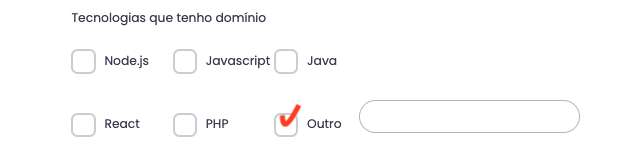

# exercicios-arnia-forms-custom-hooks

Exercícios em React para prática dos alunos da Arnia

## Exercício 1:

Crie um formulário utilizando o React Hook Form com os campos `Nome`, `E-mail`, `Telefone`, `CPF/CNPJ`, `Data de nascimento`, `Tecnologias que tenho domínio`, `Senha` e `Confirmação de senha`. 

- Crie um radio button (ou pode usar um select) pra selecionar CPF ou CNPJ
- Crie uma função que verifica se o CPF é válido, e se for inválido deve informar ao usuário no momento que ele digitar o CPF inválido (Caso esteja selecionado CPF)
- Crie uma função que verifica se o CNPJ é válido, e se for inválido deve informar ao usuário no momento que ele digitar o CNPJ inválido (Caso esteja selecionado CNPJ)
- Adicione uma validação para garantir que os valores inseridos nos campos `Senha`e `Confirmação de senha` sejam iguais.
- Adicione validações para garantir que todos os campos sejam preenchidos corretamente.
- Valide se a senha possui pelo menos 1 letra maiúscula, 1 letra minúscula, 1 número, 1 caractere especial e se possui no mínimo 8 dígitos.
- O campo `Tecnologias que tenho domínio` é um grupo de 6 checkbox com as tecnologias `PHP`, `Java`, `Javascript`, `Node`, `React`, `Outra`. Caso o usuário marque a opção `Outro`, deve aparecer um input para que ele digite qual outra tecnologia que ele domina. Segue um exemplo com o print abaixo:

- Valide para que pelo menos uma opção do grupo `Tecnologias que tenho domínio` seja selecionada. Se a opção selecionada for `Outra`, verifique se o input que apareceu para digitar a tecnologia, está preenchido.

- Assim que clicar no botão de submeter o formulário, o botão deve ficar desabilitado e depois de 2 segundos, mostre uma mensagem na tela dizendo que o formulário foi submetido com sucesso (O botão deve voltar a ficar habilitado e os campos do formulário devem estar vazios para o usuário preencher com novas informações)

## Exercício 2:

Crie um custom hook chamado `useFetch` que recebe uma URL como parâmetro e retorna os dados obtidos através de uma requisição GET.

## Exercício 3:

Crie um custom hook chamado `useLocalStorage` que permite armazenar e recuperar valores em localStorage. Ele deve receber uma chave do tipo string como parâmetro e retornar o valor armazenado.

## Exerício 4:

Crie um custom hook chamado `useDarkMode` que permite alternar entre os temas claro e escuro em um aplicativo.